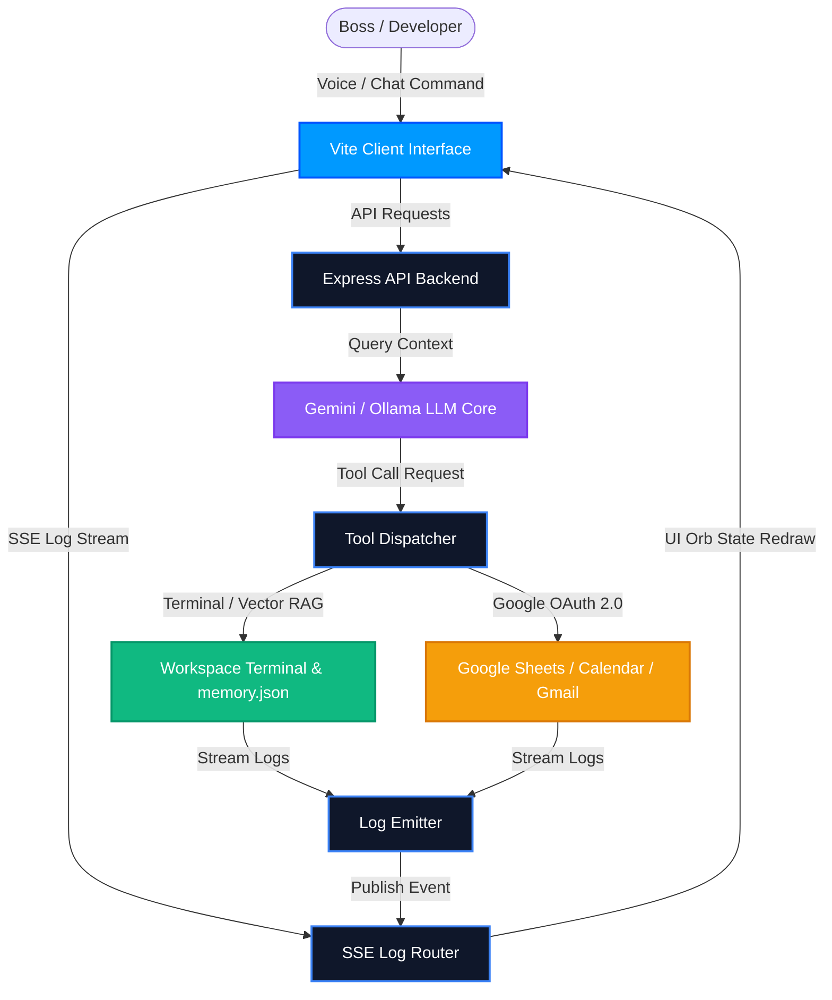
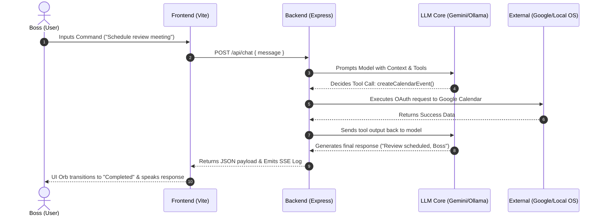
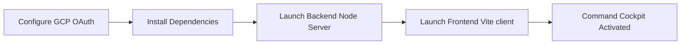

# FRIDAY OS: Personal AI Workspace Operating System
### *McKinsey-Grade Strategic Brief & Architecture Specification*

---

##  EXECUTIVE SUMMARY
**FRIDAY OS** is an offline-first, local-to-cloud workspace orchestration system designed for high-efficiency developers and technical executives. Acting as a unified "interactive cockpit," it integrates cognitive language reasoning models with local filesystem terminals and Google Workspace cloud APIs.



---

## 💎 STRATEGIC VALUE PROPOSITION

| Pillar | Capability | Core Developer Value |
| :--- | :--- | :--- |
| **Cognitive Autonomy** | Local LLM Integration + Gemini | Access to cloud-based multi-turn tool models or 100% offline local networks (via Ollama). |
| **Glassmorphic Cockpit** | Unified UI Control Center | Consolidated views of Gmail, Calendar agendas, local tasks, and active command execution. |
| **Edge Compute** | Local Terminal Console | Programmatic terminal shell runner to compile, test, and write code inside `./workspace`. |

---

## ⚙️ SYSTEM ARCHITECTURE & DATA ROUTING

The engine relies on a dual-speed processing pipeline:



---

## 🔒 ENTERPRISE-GRADE SECURITY MATRIX

```
+--------------------------------------------------------------------------+
|                        FRIDAY SECURITY PROTOCOL                          |
+--------------------------------------------------------------------------+
|                                                                          |
|  [Root Folder]                                                           |
|        |                                                                 |
|        +--- .gitignore  ===========> BLOCKS: .env, tasks.json            |
|        |                                                                 |
|        +--- .env  =================> Stores secret API keys locally     |
|                                                                          |
|  [Google Cloud Platform Console]                                         |
|        |                                                                 |
|        +--- OAuth Scopes ==========> RESTRICTED to Sheets, Calendar,     |
|                                      and Gmail modify endpoints only     |
|                                                                          |
+--------------------------------------------------------------------------+
```

1. **Ignored Variables:** The actual `.env` containing Gemini keys and Google secrets is excluded by Git in `.gitignore` to prevent credential exposure.
2. **Dynamic Tokens:** OAuth tokens are managed strictly client-side in browser session contexts, passing dynamically to backend routing layers without storage persistence.
3. **Sandbox Terminal Environment:** The terminal runner executes processes exclusively inside `./workspace` to protect root OS operating systems from command path traversals.

---

## 🚀 EXECUTION ROADMAP & STARTUP



### 1. Environment Variable Setup
Create a `.env` configuration file in the root folder matching [`.env.example`](file:///c:/Users/shreyas/Downloads/google%20ai%20automation/.env.example):
```env
GEMINI_API_KEY=your_gemini_api_key
GOOGLE_CLIENT_ID=your_gcp_client_id
GOOGLE_CLIENT_SECRET=your_gcp_client_secret
GOOGLE_REDIRECT_URI=http://localhost:3000/oauth-callback
SPREADSHEET_ID=your_sheet_id
```

### 2. Multi-Process Launch Commands
Launch the entire system from the workspace root folder:
```bash
# 1. Install all dependencies concurrently
npm run install:all

# 2. Launch both Express & React servers
npm run dev
```

*The dashboard will compile and open instantly on `http://localhost:5173`. Select your LLM provider, connect Workspace, and begin commanding your assistant.*
