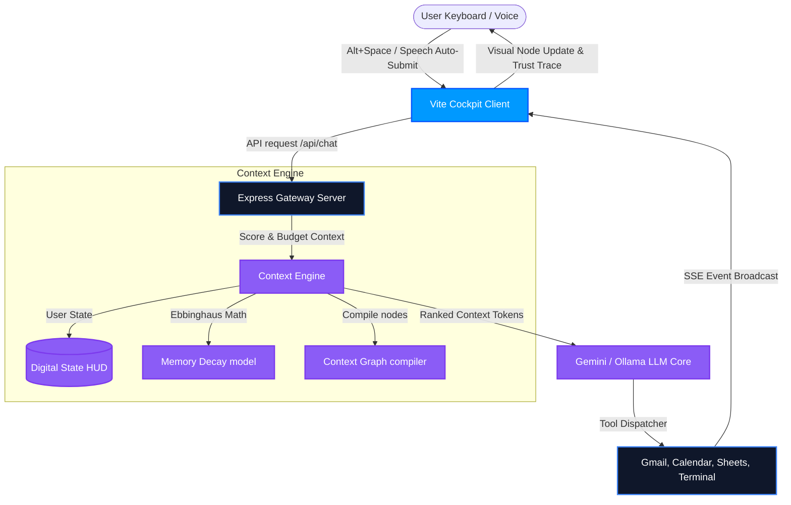
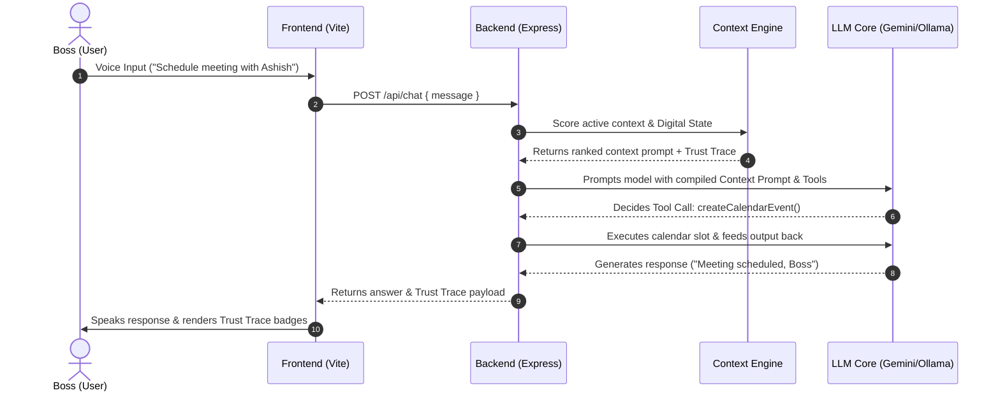

# FRIDAY OS
### *A Context-Aware AI Operating System for Personal Productivity*
*A local-first, multi-tool AI platform that unifies Gmail, Calendar, Google Sheets, workspace files, memory, and automation into a single conversational interface.*

---

## 🎯 The "WHY": The Cognitive Cost of Context-Switching
Developers and technical managers spend up to **40% of their daily cognitive energy** context-switching between fragmented tools: email inboxes, calendar agendas, local files, terminal environments, and documentation. 

Every time you open another tab, your brain has to rebuild the mental state of the project.

**FRIDAY OS solves this by introducing a unified Cognitive Operating Layer.** Rather than forcing you to open separate applications, FRIDAY creates a persistent **Context Lock** around your work. It coordinates connected tools, learns your preferences, builds a semantic map of your workspace, and displays exactly how it reasons so you can focus on high-leverage execution.

---

## 🏛️ SYSTEM ARCHITECTURE & REASONING CORE



---

## 🧠 KEY SUBSYSTEMS

### 1. The Context Engine
The central orchestrator of user context. Instead of dumping raw chat logs into the LLM prompt, the Context Engine dynamically filters, formats, and ranks inputs:
* **Digital State Tracker:** Models your current productivity variables (mood, energy level, current focus, goal progress, blockers, and pending decisions).
* **Context Budgeting:** Computes context token weight constraints. Only the highest-ranked context resources (State, active files, relevant memories) are injected into the LLM system prompt, protecting token limits and preventing hallucinations.
* **Ebbinghaus Memory Decay:** Simulates memory retention based on:
  $$\text{decayScore} = \text{importance} \times e^{-\lambda \times \Delta t} + \log_2(1 + \text{frequency})$$
  Old, irrelevant context facts decay over time, while frequently retrieved preferences are reinforced.

### 2. Interactive Context Graph
Constructs a dynamic relationship map of your workspace. It links your User profile, active Goals, local code files inside `./workspace`, and memories into a visual, traversable network of nodes. When FRIDAY writes code or syncs calendar slots, the graph visualizes the connectivity of the system.

### 3. Explainable AI (Trust Trace)
Every instruction executed by FRIDAY is fully traceable. Response timeline bubbles contain collapsible **Trust Trace badges** detailing the exact context resources utilized and their relative confidence/relevance weights (e.g. `[👤 State (100%)]`, `[📁 main.ts (75%)]`), building transparency and user trust.

---

## ⚙️ DUAL-SPEED PIPELINE EXECUTION



---

## 🚀 GETTING STARTED

### 1. Environment Variable Setup
Create a `.env` configuration file in the root directory matching [`.env.example`](file:///c:/Users/shreyas/Downloads/google%20ai%20automation/.env.example):
```env
GEMINI_API_KEY=your_gemini_api_key
GOOGLE_CLIENT_ID=your_gcp_client_id
GOOGLE_CLIENT_SECRET=your_gcp_client_secret
GOOGLE_REDIRECT_URI=http://localhost:3000/oauth2callback
GOOGLE_SHEET_ID=your_sheet_id
```

### 2. Multi-Process Launch
Start the client and server watch towers concurrently from the root folder:
```bash
# 1. Install all dependencies concurrently
npm run install:all

# 2. Launch both Express & React servers
npm run dev
```

*The dashboard will compile and open instantly on `http://localhost:5173`. Open Settings, set your Voice Accent to English (India), update your Digital State variables, and begin commanding your Cognitive Operating Layer.*
